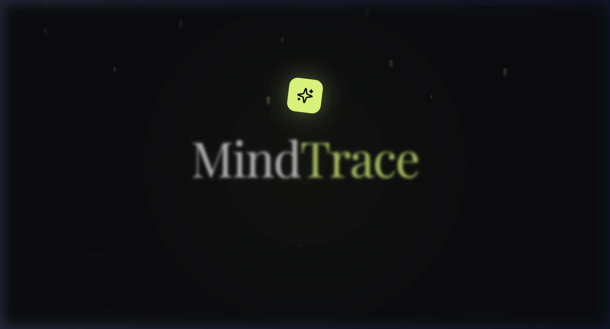
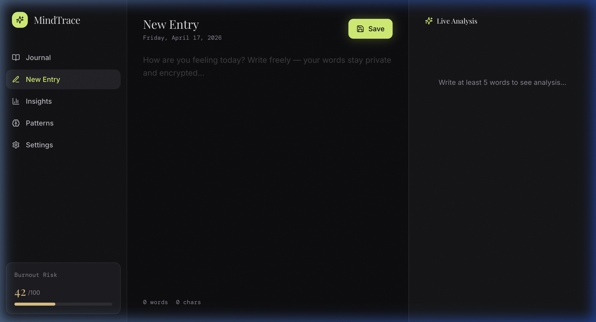

# MindTrace — AI-Powered Mental Health Journaling

MindTrace is a modern, privacy-focused mental health journaling application designed to help users track their emotional landscape through AI-driven insights and beautiful data visualization.



## 🌟 Features

- **Live Emotional Analysis**: Real-time sentiment and emotion detection as you write.
- **Visual Insights**: Dynamic heatmaps and timeline charts to track mood trends over time.
- **Pattern Recognition**: Identify recurring themes and burnout risks using behavioral data.
- **Privacy First**: Local-first storage (currently using `localStorage`) ensuring your data stays in your control.
- **Rich Aesthetics**: A premium, minimalist interface with smooth animations and a calming design system.

## 📸 Screenshots

### Journal Entry & Live Analysis
Write freely while MindTrace analyzes your dominant emotions, arousal levels, and word counts in real-time.


## 🛠️ Tech Stack

- **Framework**: [React 18](https://reactjs.org/) with [Vite](https://vitejs.dev/)
- **Styling**: [Tailwind CSS](https://tailwindcss.com/)
- **Components**: [Shadcn UI](https://ui.shadcn.com/)
- **Animations**: [Framer Motion](https://www.framer.com/motion/)
- **Icons**: [Lucide React](https://lucide.dev/)
- **Charts**: [Recharts](https://recharts.org/)
- **State Management**: [TanStack Query](https://tanstack.com/query/latest)

## 🚀 Real-World Use Cases & Ideas

MindTrace is more than just a diary; it's a tool for emotional intelligence. Here are some real-world application ideas:

1. **Therapy Companion**: Users can share their weekly "Insights" summary with their therapist to show emotional oscillations that might be hard to recall during a session.
2. **Burnout Prevention for Professionals**: By tracking keywords like "drained" or "exhausted" alongside arousal spikes, the app can proactively suggest a "digital detox" or a mental health day.
3. **Cognitive Behavioral Therapy (CBT)**: Use the journal to identify "Thinking Traps" or recurring negative themes, allowing users to consciously reframe their thoughts.
4. **Sleep & Mood Correlation**: Integrate with wearable data to see how sleep quality directly impacts the "Mood Timeline."
5. **Crisis Intervention**: For high-risk individuals, the app could be set to alert a trusted contact or provide resources if the "Crisis Flag" is triggered by specific linguistic markers.

## 📦 Installation & Setup

1. **Clone the repository**:
   ```bash
   git clone https://github.com/Shanvie/mindtrace.git
   cd mindtrace
   ```

2. **Install dependencies**:
   ```bash
   npm install
   ```

3. **Run the development server**:
   ```bash
   npm run dev
   ```

4. **Open your browser**:
   Navigate to `http://localhost:8080` to start tracing your mind.

---

*Made with ❤️ for Mental Health Awareness.*
